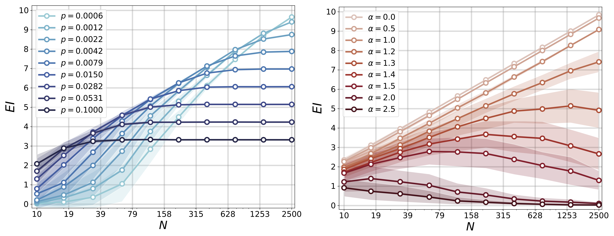

# Effective information and causal emergence in networks

Python code for calculating *effective information* in networks. This can 
then be used to search for macroscale representations of a network such 
that the coarse grained representation has more effective information than 
the microscale, a phenomenon known as *causal emergence*.

<p align="center">

</p>

This code accompanies the recent paper: 

**Uncertainty and causal emergence in complex networks**\
Brennan Klein and Erik Hoel, 2019.\
[arXiv:1907.03902](https://arxiv.org/abs/1907.03902)

## Installation and Usage

In order to use this code, clone/download the repository. The tutorial 
notebooks are designed to walk through some of the main results from the
[paper above](https://arxiv.org/abs/1907.03902), in addition to several
in-depth analyses that were not included in the original paper.

For starters, follow along in the 
```Chapter 01 - Chapter 01 - Network Effective Information.ipynb``` notebook.


