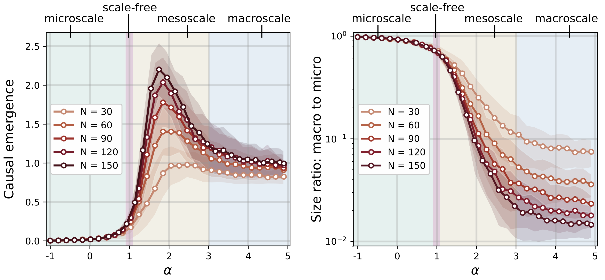

# Effective information and causal emergence in networks

Python code for calculating *effective information* in networks. This can 
then be used to search for macroscale representations of a network such 
that the coarse grained representation has more effective information than 
the microscale, a phenomenon known as *causal emergence*.

<p align="center">

</p>

<p align="center">Effective information vs network size.

<p align="center">

</p>

<p align="center">Causal emergence vs preferential attachment.</center>

This code accompanies the recent paper: 

**Uncertainty and causal emergence in complex networks**\
Brennan Klein and Erik Hoel, 2019.\
[arXiv:1907.03902](https://arxiv.org/abs/1907.03902)


## Tutorial Notebooks (work in progress...)
1. [Chapter 01 - Network Effective Information](https://nbviewer.jupyter.org/github/jkbren/einet/blob/master/code/Chapter%2001%20-%20Network%20Effective%20Information.ipynb)
2. [Chapter 02 - Network Size and Effective Information](https://nbviewer.jupyter.org/github/jkbren/einet/blob/master/code/Chapter%2002%20-%20Network%20Size%20and%20Effective%20Information.ipynb)
3. [Chapter 03 - Determinism and Degeneracy](https://nbviewer.jupyter.org/github/jkbren/einet/blob/master/code/Chapter%2003%20-%20Determinism%20and%20Degeneracy.ipynb)
4. [Chapter 04 - Effective Information in Real Networks](https://nbviewer.jupyter.org/github/jkbren/einet/blob/master/code/Chapter%2004%20-%20Effective%20Information%20in%20Real%20Networks.ipynb)
5. [Chapter 05 - Causal Emergence in Preferential Attachment and SBMs](https://nbviewer.jupyter.org/github/jkbren/einet/blob/master/code/Chapter%2005%20-%20Causal%20Emergence%20in%20Preferential%20Attachment%20and%20SBMs.ipynb)
6. [Chapter 06 - Causal Emergence and the Emergence of Scale](https://nbviewer.jupyter.org/github/jkbren/einet/blob/master/code/Chapter%2006%20-%20Causal%20Emergence%20and%20the%20Emergence%20of%20Scale.ipynb)

## Installation and Usage

In order to use this code, first clone/download the repository. 
Below is a simple example usage. Please note: please feel free to reach 
out if you find any bugs, have any questions, or if for some reason
the code does not run. (I'm new at this!)

```Python
import networkx as nx
import numpy as np
from ei_net import *

G = nx.karate_club_graph()

print("EI(G) =", EI(G))
```

Result:
```text
EI(G) = 2.3500950888734686
```

The tutorial notebooks are designed to walk through some of the 
main results from the [paper above](https://arxiv.org/abs/1907.03902), 
in addition to several in-depth analyses that were not included in 
the original paper.

## Requirements  <a name="requirements"/>

This code is written in [Python 3.x](https://www.python.org) and uses 
the following packages:

* [NetworkX](https://networkx.github.io)
* [Scipy](http://www.scipy.org/)
* [Numpy](http://numpy.scipy.org/)
* And for replicating figures, you will need:
    + [matplotlib](https://matplotlib.org)
    + [Pandas](https://pandas.pydata.org/)


## Citation   <a name="citation"/>

If you use these methods and this code in your own research, please cite our paper:

Brennan Klein and Erik Hoel, **Uncertainty and causal emergence in complex networks** (2019)
[arXiv:1907.03902](https://arxiv.org/abs/1907.03902)

Here is a bibtex entry:
```text
@article{klein2019causalemergence,
  title={Uncertainty and causal emergence in complex networks},
  author={Klein, Brennan and Hoel, Erik},
  journal={arXiv preprint arXiv:1907.03902},
  year={2019}
}
```

## See also:

* Hoel, E. (2017). **When the map is better than the territory**. *Entropy*. 19(5), 188; doi: [10.3390/e19050188](https://www.mdpi.com/1099-4300/19/5/188).
    + recent work making explicit connections between causal emergence to the channel capacity.
* Hoel, E., Albantakis, L., & Tononi, G. (2013). **Quantifying causal emergence shows that macro can beat micro**. *Proceedings of the National Academy of Sciences*. 110 (49) 19790-19795. doi: [10.1073/pnas.1314922110](https://www.pnas.org/content/110/49/19790).
    + the first work to quantify causal emergence, that coarse grained models can have more effective information.
